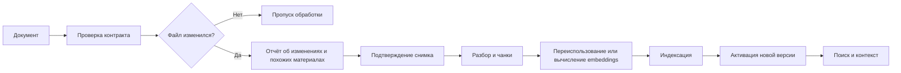

<div align="center">

# WorkflowRAG

**Документы меняются. База знаний должна успевать за ними.**

Сервер для загрузки, версионирования и поиска документов в RAG-системах.
Проверяет обновления, сохраняет историю и переиспользует подходящие embeddings.


[Возможности](#что-уже-работает) · [Запуск](#быстрый-запуск) · [Развитие](#куда-идём) · [Руководство и API](docs/usage.md)

</div>

---

## Зачем нужен WorkflowRAG

Проиндексировать документы один раз — только начало. Дальше меняются инструкции, уточняется документация, появляются новые версии. Нужно понять, что обновилось, не пересчитывать неизменившийся текст и не потерять рабочую базу знаний, если обработка завершилась ошибкой.

**WorkflowRAG управляет этим циклом:** от предварительной проверки файла до активации новой версии и выдачи контекста для языковой модели.

Проект предназначен для разработчиков, которые строят помощников по документации или подключают собственную базу знаний к AI-приложению. Сейчас это сервер с HTTP API; пользовательский интерфейс и генерация итоговых ответов — следующие направления развития.

## Что уже работает

| Возможность | Что это даёт |
|---|---|
| **Проверка до обработки** | Контроль формата, UTF-8, размера, наличия текста, числа секций и чанков. Невалидный документ не запускает индексацию. |
| **Предпросмотр и подтверждение** | Отчёт об изменениях и похожих материалах. После подтверждения обрабатывается именно проверенный снимок файла. |
| **История версий** | Предыдущая активная версия остаётся доступна для поиска до успешной активации новой. |
| **Инкрементальные вычисления** | Неизменившиеся входы embedding-модели переиспользуются даже после перемещения чанков. |
| **Пропуск неизменённых файлов** | Повторная загрузка тех же байтов под тем же идентификатором не создаёт новую версию или задачу. |
| **Управляемый workflow** | Состояние каждой стадии, продолжение неудачной задачи и защита от активации устаревшей версии. |
| **Семантический и гибридный поиск** | Векторный поиск, PostgreSQL full-text search и объединение результатов через RRF. |
| **Расширение контекста** | Возврат отдельного чанка, небольшой секции целиком или соседних чанков. |
| **Локальная обработка** | PostgreSQL/pgvector и Ollama с BGE-M3; основной сценарий не требует облачного API модели. |

Поддерживаются **TXT и Markdown**. Файл можно прочитать из настроенного локального источника или передать через multipart-загрузку.

## Как это устроено



После подтверждения выполняется цепочка `parse → chunk → embed → index → activate`. При сбое предыдущая активная версия продолжает обслуживать поиск. Для автоматизации также доступна одноступенчатая загрузка без ручного подтверждения.

### Пример обновления

В документе три отдельных абзаца. После первой загрузки для них вычислены три embeddings.

1. Добавили новый абзац — вычисляется embedding нового фрагмента, подходящие старые используются повторно.
2. Переставили существующие абзацы — смена позиции сама по себе не требует пересчёта.
3. Изменили текст абзаца — пересчитывается изменившийся вход модели.

Это работает при совпадении фактического текста, контекста заголовков и параметров модели. Смена модели, заголовков или границ фрагмента может потребовать новых вычислений. История хранит полные версии: экономия относится к вычислениям, а не к хранению только разницы между файлами.

## Быстрый запуск

Нужны **JDK 21**, **Docker** и **Ollama**. Выполняйте команды из корня репозитория.

```powershell
docker compose -f infra/docker-compose.yml up -d
ollama pull bge-m3
./mvnw.cmd verify
java -jar WorkflowRAG-src/target/WorkflowRAG-src-0.0.1-SNAPSHOT.jar --spring.profiles.active=dev
```

На Linux/macOS используйте `./mvnw` вместо `./mvnw.cmd`. Подойдёт и установленный Maven: `mvn verify`. Ollama должен быть запущен; при необходимости используйте `ollama serve` в отдельном терминале.

Профиль `dev` подключается к PostgreSQL на порту **55432**, запускает приложение на **8080** и использует источник `demo` из каталога [`knowledge`](knowledge). В нём уже есть документ для первой загрузки.

### Попробовать на примере

PowerShell, в отдельном терминале:

```powershell
$api = 'http://localhost:8080/api/v1'
$document = @{ sourceId = 'demo'; externalDocumentId = 'getting-started.md' } | ConvertTo-Json

# Проверить документ и посмотреть отчёт
$preview = Invoke-RestMethod -Method Post -Uri "$api/ingestions/previews/source" -ContentType application/json -Body $document
$preview | ConvertTo-Json -Depth 8

# Подтвердить обработку, если документ готов к загрузке
if ($preview.canConfirm) {
    Invoke-RestMethod -Method Post -Uri "$api/ingestions/previews/$($preview.id)/confirm"
}

# Найти информацию в загруженном документе
$query = @{ query = 'What happens when an update fails?'; sourceId = 'demo'; profile = 'HYBRID'; limit = 3 } | ConvertTo-Json
Invoke-RestMethod -Method Post -Uri "$api/retrieval/search" -ContentType application/json -Body $query
```

Настройка источников и моделей, загрузка файла, контекст, повтор задач и обновление базы — в [подробном руководстве](docs/usage.md).

## Структура проекта

| Каталог | Назначение |
|---|---|
| [`WorkflowRAG-api`](WorkflowRAG-api) | Контракты HTTP API, запросы и ответы. |
| [`WorkflowRAG-src`](WorkflowRAG-src) | Сервер и функциональные модули: источники, предварительная проверка, документы, workflow, чанки, embeddings, поиск и контекст. |
| [`infra`](infra) | Локальная инфраструктура PostgreSQL/pgvector. |
| [`knowledge`](knowledge) | Пример базы знаний для запуска. |
| [`docs`](docs) | Руководство и описания решений. |

Внутри функциональных модулей разделены контроллеры, сервисы, модели и доступ к данным. Миграциями базы управляет Liquibase.

## Куда идём

Ближайший фокус — довести серверный цикл работы с изменяющейся базой знаний. Интерфейс подключим к готовой логике.

- [x] Загрузка, версии документов и workflow обработки.
- [x] Проверка документа, предпросмотр и подтверждение снимка.
- [x] Переиспользование embeddings независимо от позиции фрагмента.
- [x] Семантический и гибридный поиск, расширение контекста.
- [ ] Улучшение проверки похожих материалов и оценка качества поиска на реальных документах.
- [ ] Автоматическое обнаружение изменений источников и запуск обновлений.
- [ ] Поддержка дополнительных форматов и источников.
- [ ] Интеграция с языковой моделью для ответов с опорой на найденные источники; MCP-интерфейс.
- [ ] Веб-интерфейс: загрузка, проверка изменений, история, задачи и поиск.

Это направления развития, а не обещание сроков. Приоритеты будут уточняться по реальным сценариям использования.

## Текущие границы

- **Проект в активной разработке.** Загрузка пока синхронная; рассчитана на один экземпляр приложения на базу.
- **Чанкинг структурный.** Границы определяются разделами, абзацами и размером. Это не смысловое разбиение языковой моделью.
- **Похожесть — подсказка.** Предварительный поиск использует ограниченную выборку. Отсутствие совпадений не доказывает уникальность документа.
- **Reranker опционален.** Режим `ADVANCED` требует совместимых ONNX-файлов модели и токенизатора. Без них доступны `SIMPLE` и `HYBRID`.
- **Форматы и модели ограничены.** Парсеры реализованы для TXT/Markdown; текущая векторная схема рассчитана на 1024 измерения.
- **UI, наблюдение за каталогами и генерация ответов пока не реализованы.** Поиск возвращает фрагменты и контекст для дальнейшего использования.

## Проверка и обратная связь

`mvn verify` собирает запускаемый JAR и выполняет unit- и интеграционные проверки. Интеграционные сценарии используют отдельные контейнеры PostgreSQL/pgvector; embeddings в автоматических тестах вычисляет тестовый provider. Проверяются HTTP API, обновления, повтор задач, миграции, подтверждение снимков и переиспользование вычислений.

Нашли проблему или хотите обсудить сценарий? [Создайте issue](https://github.com/AnsarAdd/WorkflowRAG/issues). Особенно полезны примеры документов, ожидаемые результаты поиска и случаи, когда обновление приводит к лишним вычислениям. Используйте примеры без конфиденциальных данных.
